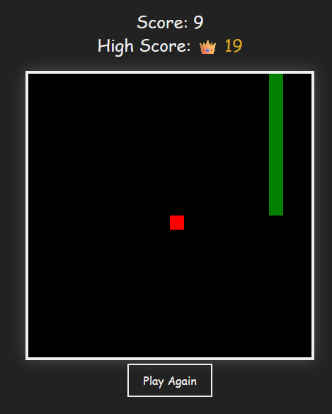

# Classic Snake Game 🐍

This is a modernized take on the classic Snake game, built using JavaScript, HTML5 canvas, and CSS. Enjoy the nostalgic arcade experience with customizable settings and local high score tracking!

## Features ✨

- **Customizable Grid Size:** Adjust the game board size to your liking for different levels of challenge.
- **Smooth Gameplay:** Experience fluid snake movement and animations. 
- **Local High Score:**  Your high score is saved locally, so you can try to beat it every time you play!
- **Clean and Modern UI:**  Enjoy a visually appealing and user-friendly game interface.
- **Responsive Design:** The game adapts to different screen sizes (try it on your phone!).

<br>

## Demo 🚀

 

<br>

## How to Play 🎮

- Use the **arrow keys** to control the direction of the snake.
- Eat the **red food** to grow longer and increase your score.
- Avoid hitting the **walls** or **yourself** - or it's game over!
- Customize the **grid size** in the settings before you start.

<br>

## Installation 📥

1. Clone the repository: 
   ```bash
   git clone https://github.com/RGB-Outl4w/Classic-Snake-Game.git 
   ```
2. Navigate to the project directory: 
   ```bash
   cd Classic-Snake-Game
   ```
3. Open `~/snake-game/index.html` in your web browser.

<br>

## Technologies Used 💻

- HTML5
- CSS3
- JavaScript


## Contributing 🤝

Contributions are welcome! If you find any bugs or have suggestions for improvement, feel free to open an issue or create a pull request.


## License 📄

This project is licensed under the [MIT License](LICENSE).
